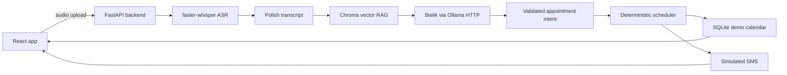

# Medical Scheduling Agent

Demo web application for voice-based appointment scheduling in Polish.

The system accepts a patient voice recording, transcribes it locally, uses Bielik with
vector RAG knowledge to estimate appointment intent and duration, validates the result
with deterministic scheduling code, writes the appointment into a simulated calendar,
and returns a short SMS-style confirmation.

This is a scheduling demo, not a medical device. It does not make diagnoses, does not
send real SMS messages, and does not integrate with real clinic systems.

## What The Demo Shows

- A patient records a Polish voice message in the browser.
- The backend receives the audio file through FastAPI.
- Local ASR transcribes the recording with `faster-whisper`.
- Bielik analyzes the transcript in Polish.
- Vector RAG retrieves appointment-duration rules from a Chroma index.
- A deterministic scheduler checks calendar availability before creating an event.
- The frontend shows the transcript/debug summary, SMS-style response, and calendar.

## Architecture



## Tech Stack

Backend:

- Python 3.11+
- FastAPI and Uvicorn
- Pydantic Settings
- faster-whisper
- Bielik through an Ollama-compatible HTTP API
- ChromaDB and sentence-transformers for local vector RAG
- SQLite demo persistence
- pytest and ruff

Frontend:

- React
- TypeScript
- Vite
- React Router
- responsive custom CSS
- lucide-react icons

## Repository Layout

```text
backend/
  app/
    api/              FastAPI route modules
    core/             settings and logging
    models/           Pydantic request/response schemas
    services/         ASR, Bielik, RAG, scheduling, SMS services
    main.py           FastAPI application factory
  tests/
  pyproject.toml

frontend/
  src/
    api/              typed backend client
    components/       reusable UI components
    pages/            recorder and calendar pages
    types/            shared TypeScript API types
  package.json

data/
  rag/                active RAG source documents
  rag/examples/       optional starter rule datasets
  rag/schema/         structured rule schema
  samples/            local sample audio files, ignored by Git

deploy/
  docker-compose.local.yml
  cloud-run/
  ollama-bielik/
  ollama-embedding/

docs/
  architecture.md
  requirements.md
  local-models.md
```

## Runtime Profiles

The repository ships two environment templates:

- `.env.example.local-ollama` for local development with a local Ollama-compatible Bielik server.
- `.env.example.cloud-run` for Cloud Run-style deployments where the backend calls model services over HTTP.

The plain `.env.example` only explains which profile to copy. It intentionally contains
no private model paths or machine-specific configuration.

## Local Quick Start

These commands assume PowerShell on Windows.

### 1. Prepare Environment

From the repository root:

```powershell
Copy-Item .env.example.local-ollama .env
```

The local profile expects:

- backend at `http://127.0.0.1:8097`
- frontend at `http://localhost:5173`
- Bielik model server at `http://127.0.0.1:11434`
- vector RAG index under `data/chroma`
- RAG source files under `data/rag`
- demo calendar events in SQLite at `data/demo.sqlite3`

### 2. Start Bielik Model Server

Use any Ollama-compatible server that exposes `/api/chat`.

With Ollama installed locally:

```powershell
ollama serve
```

In another terminal:

```powershell
ollama pull SpeakLeash/bielik-4.5b-v3.0-instruct:Q8_0
```

Smoke test:

```powershell
Invoke-RestMethod `
  -Uri http://127.0.0.1:11434/api/chat `
  -Method Post `
  -ContentType "application/json" `
  -Body '{
    "model": "SpeakLeash/bielik-4.5b-v3.0-instruct:Q8_0",
    "messages": [{"role": "user", "content": "Odpowiedz jednym zdaniem po polsku."}],
    "stream": false
  }'
```

Alternative Docker Compose assets are available in `deploy/docker-compose.local.yml`.

### 3. Install Backend

```powershell
cd backend
python -m venv .venv
.\.venv\Scripts\Activate.ps1
python -m pip install --upgrade pip
pip install -e ".[dev]"
cd ..
```

### 4. Build The Vector RAG Index

RAG source files live in `data/rag`. The files are source knowledge, not the retrieval
backend. Retrieval becomes vector RAG only after the Chroma index is built.

Start the backend:

```powershell
cd backend
.\.venv\Scripts\Activate.ps1
uvicorn app.main:app --reload --host 127.0.0.1 --port 8097
```

In another terminal, rebuild the index:

```powershell
Invoke-RestMethod -Uri http://127.0.0.1:8097/api/rag/ingest -Method Post
```

Run ingestion again after changing rules under `data/rag`.

### 5. Install And Start Frontend

```powershell
cd frontend
npm install
npm run dev
```

Open:

```text
http://localhost:5173
```

The recorder page sends audio to:

```text
http://127.0.0.1:8097/api/voice/appointments
```

The calendar page loads events from the backend automatically.

## Manual Smoke Tests

Backend health:

```powershell
Invoke-RestMethod http://127.0.0.1:8097/health
```

Expected fields include:

- `status`
- `runtime_profile`
- `llm_provider`
- `rag_backend`
- `asr_provider`

RAG ingestion:

```powershell
Invoke-RestMethod -Uri http://127.0.0.1:8097/api/rag/ingest -Method Post
```

Calendar:

```powershell
Invoke-RestMethod http://127.0.0.1:8097/api/calendar/events
```

Debug text analysis without recording audio:

```powershell
Invoke-RestMethod `
  -Uri http://127.0.0.1:8097/api/debug/appointment-analysis `
  -Method Post `
  -ContentType "application/json" `
  -Body '{"transcript":"Dzień dobry, boli mnie głowa i chciałbym krótką wizytę we wtorek po 10."}'
```

## Customizing Medical Rules

Put clinic-specific rules under `data/rag`.

Supported active formats:

- Markdown
- text
- CSV
- JSONL

Structured rules should describe:

- `procedure_name`
- `specialty`
- `duration_minutes`
- `duration_rationale`
- `patient_preparation`
- `contraindications_for_auto_booking`
- `source`

Examples are available in `data/rag/examples`. Copy example files into `data/rag`
or replace them with a clinic-specific rule set. After each change, run:

```powershell
Invoke-RestMethod -Uri http://127.0.0.1:8097/api/rag/ingest -Method Post
```

The scheduler supports visit durations normalized to `30`, `60`, `90`, and `120`
minutes.

## Storage Strategy

Local development uses SQLite for the simulated appointment calendar:

```env
CALENDAR_STORAGE_BACKEND=sqlite
SQLITE_DATABASE_URL=sqlite:///data/demo.sqlite3
SEED_DEMO_CALENDAR=true
```

This keeps booked demo appointments available across backend restarts on one
developer machine. Focused unit tests can still use the in-memory repository.

The vector RAG source of truth is the document set under `data/rag`. The Chroma
index under `data/chroma` is generated data and can be rebuilt with
`POST /api/rag/ingest`.

## Testing

Backend checks:

```powershell
cd backend
.\.venv\Scripts\Activate.ps1
python -m ruff check .
python -m pytest tests -m "not local_ai"
```

Local AI acceptance tests are marked separately because they load real models:

```powershell
python -m pytest tests -m local_ai
```

Frontend build:

```powershell
cd frontend
npm run build
```

## Cloud Run Deployment Direction

The cloud profile is intentionally explicit:

```powershell
Copy-Item .env.example.cloud-run .env
```

Set at least:

- `CORS_ORIGINS` to your frontend URL.
- `OLLAMA_BASE_URL` to the deployed Bielik model service URL.
- storage paths suitable for your runtime.

Deployment helper scripts live in:

- `deploy/cloud-run/backend-cloud-run.sh`
- `deploy/cloud-run/bielik-cloud-run.sh`
- `deploy/cloud-run/embedding-cloud-run.sh`

They are parameterized through environment variables such as `PROJECT_ID`, `REGION`,
and service names. The current cloud assets are a deployment starting point, not a
complete production architecture. A production version should add authentication,
persistent storage, observability, request limits, and secrets management.

Minimal Cloud Run order:

```bash
export PROJECT_ID="your-project-id"
export REGION="europe-west1"
./deploy/cloud-run/bielik-cloud-run.sh

export FRONTEND_ORIGIN="https://your-frontend.example.com"
export OLLAMA_BASE_URL="https://your-bielik-service-url"
./deploy/cloud-run/backend-cloud-run.sh
```

The default cloud backend profile uses CPU ASR (`ASR_DEVICE=cpu`,
`ASR_COMPUTE_TYPE=int8`) to keep the public demo easier to deploy. The Chroma
index and SQLite database use `/tmp` paths in the template, so they are temporary.

For durable cloud storage, set:

```env
CLOUD_STORAGE_MODE=persistent
DATABASE_URL=...
```

`DATABASE_URL` should point to durable database storage, for example a Cloud SQL
connection exposed to the container after a matching SQL driver/repository is
added. The current committed implementation provides the storage boundary and
SQLite persistence; managed cloud database support is the next extension point.
Durable vector RAG should use a persistent vector backend or a deploy-time rebuild
process from durable rule sources.

## Safety And Scope

- The assistant schedules appointments only.
- It must not diagnose patients.
- If the model output is invalid, uncertain, or conflicts with calendar rules, the
  backend returns a callback-needed SMS instead of silently booking an appointment.
- There are no silent LLM/RAG fallbacks. Broken model or RAG configuration should fail
  visibly during testing.

## Useful Documentation

- `docs/architecture.md`
- `docs/requirements.md`
- `docs/local-models.md`
- `data/rag/README.md`
- `deploy/README.md`
