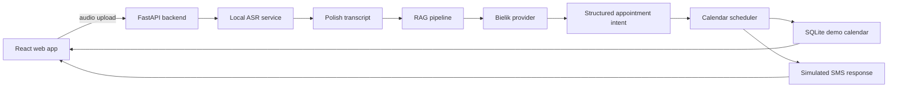

# Architecture

## High-Level Flow

## Backend Boundaries

- API layer receives files and returns typed responses.
- ASR service converts audio to transcript.
- RAG service retrieves expert knowledge through the explicitly configured backend and prompts Bielik.
- Scheduling service owns office hours, seeded appointments, and slot selection.
- SMS service formats a short confirmation message.
- Storage layer keeps demo calendar data.

## Frontend Routes

- `/` redirects to `/record`.
- `/record` records voice and submits the scheduling request.
- `/calendar` displays seeded and newly created appointments.

## Demo Data

The calendar starts with deterministic seed appointments. Expert RAG files live under `data/rag` and should be plain Markdown or text documents describing appointment categories, durations, and scheduling rules.

## RAG Backend Strategy

RAG backend selection is explicit through `RAG_BACKEND`:

- `file`: deterministic local Markdown/TXT retrieval for simple demos.
- `chroma`: local vector search with ChromaDB and sentence-transformers.
- `bigquery-vector`: cloud vector-search extension point. It is configured but not implemented yet.

The backend does not silently fall back from one RAG backend to another. If `RAG_BACKEND=chroma` is selected and the Chroma store is missing, the request fails with a clear backend error instead of using file retrieval.

## Model Loading Strategy

The application starts in mock mode by default. Real model loading should be lazy:

- ASR model is loaded on first transcription request.
- Bielik model is loaded on first RAG analysis request when `LLM_PROVIDER=llama-cpp`.
- Bielik is called through HTTP when `LLM_PROVIDER=ollama-http`.
- Embedding model and ChromaDB index are initialized only when `RAG_BACKEND=chroma` requires them.

This keeps startup fast and makes local demos possible before model files are available.
